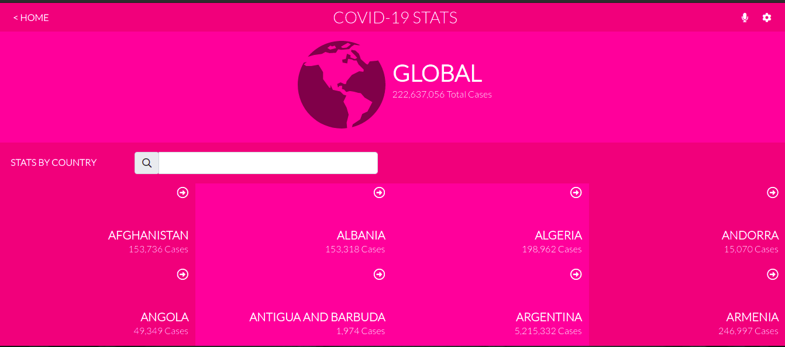

# Metrics WebApp

> This is a mobile web application that displays a list of metrics generated from the [Narrativa API](https://covid19tracking.narrativa.com/index_en.html). This API provides data on COVID-19.



## Milestones completed:
- Create a new React App using CRA.
- Install app dependencies.
- Build file structure for app.
- Create routes and navigation in app.
- Display list of items gotten from [Narrativa API](https://covid19tracking.narrativa.com/index_en.html).
- Writes unit tests for pure functions.
- Create integration tests using React Testing Library.
- Style components to match design on [behance](https://www.behance.net/gallery/31579789/Ballhead-App-(Free-PSDs)).
- To get started with CRA, see more information below:
  
========

## Built With

- React.Js
- Redux
  
  [Live Link](https://admiring-edison-ccbd9a.netlify.app/)
 ## Getting Started

To get a local copy up and running follow these simple example steps.

### Prerequisites

- NodeJS - [v16.x](https://nodejs.org/en/)

### Setup

```bash
git clone https://github.com/CollinsTatang/React-Capstone.git
cd ./React-Capstone
```

### Install

```bash
npm install
```

### Usage

```bash
npm start
```

### Build

```bash
npm run build
```

### Run tests

```bash
npm test
```

## Authors

👤**Makungong Collins Tatang**

- GitHub: [@CollinsTatang1](https://github.com/CollinsTatang)
- Twitter: [@CollinsTatang1](https://twitter.com/CollinsTatang1)
- LinkedIn: [Makungong Collins](https://www.linkedin.com/in/makungong-collins/)

## 🤝 Contributing

Contributions, issues, and feature requests are welcome!

Feel free to check the [issues page](../../issues/).

## Show your support

Give a ⭐️ if you like this project!

## Acknowledgments

- Microverse
- [Microverse design team](https://app.zeplin.io/project/5b35a9e13227086040f8eb75/screen/5b695e29bb8c844f118f9378)

## 📝 License

This project is [MIT](./LICENSE) licensed.